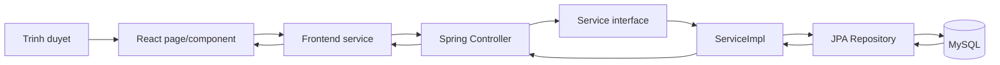
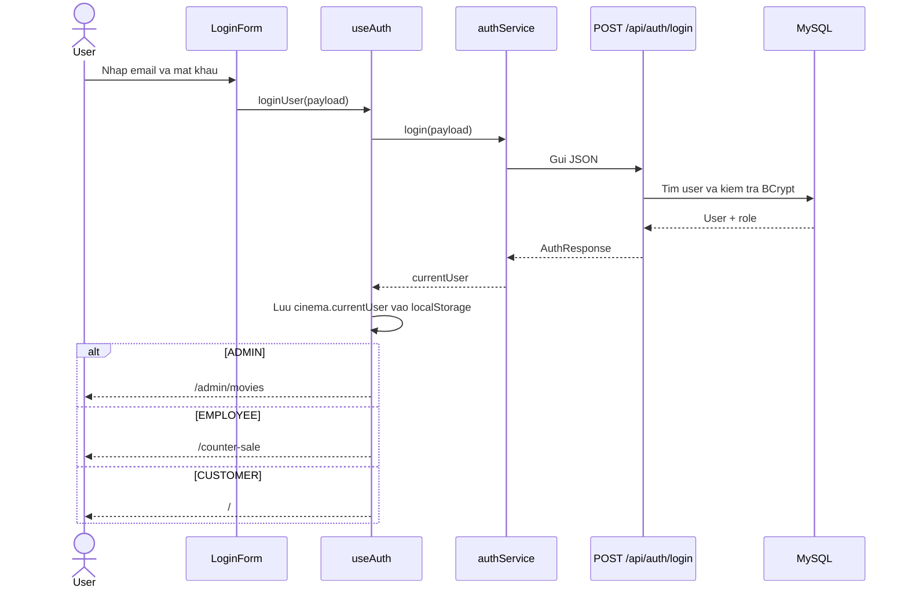

# Premiere Cinemas - Project Context and Handoff

> Cap nhat boi canh: 30/09/2026
>
> Tai lieu nay dung de thanh vien hoac mot cuoc tro chuyen Codex moi co the tiep tuc du an ma khong phai doc lai toan bo lich su trao doi.

## 1. Muc tieu du an

Day la he thong quan ly rap chieu phim gom ba nhom nguoi dung:

- `CUSTOMER`: xem phim, tim kiem, loc phim, xem lich chieu, gia ve, chi tiet phim va danh gia phim.
- `ADMIN`: quan ly phim, khuyen mai, phong chieu, lich chieu, gia ve va cac nghiep vu quan tri.
- `EMPLOYEE`: ban ve tai quay. Module nay da co code trong du an.

Cong nghe chinh:

- Backend: Java 21, Spring Boot, Spring MVC, Spring Data JPA, Bean Validation, MySQL, Gradle.
- Frontend: React 19, TypeScript, Vite, React Router, Bootstrap va CSS tu viet.
- Luu anh: Cloudinary.
- Database: MySQL, database mac dinh la `cinema_management`.

## 2. Cau truc thu muc

```text
cinema-management/
|-- backend/                 Spring Boot API
|   |-- src/main/java/com/cinemamanagement/
|   |   |-- config/          Cau hinh CORS, password encoder, Cloudinary, khoi tao du lieu
|   |   |-- controller/      Nhan HTTP request va tra response
|   |   |-- entity/          Anh xa bang MySQL bang JPA
|   |   |-- exception/       Exception va xu ly loi tap trung
|   |   |-- repository/      Truy van du lieu
|   |   |-- request/         Du lieu dau vao API va validation
|   |   |-- response/        Du lieu API tra ve
|   |   |-- service/         Interface nghiep vu
|   |   `-- service/impl/    Code trien khai nghiep vu
|   `-- src/main/resources/application.properties
|-- frontend/                React + TypeScript
|   |-- src/
|   |   |-- component/       Thanh phan giao dien tai su dung hoac theo tinh nang
|   |   |-- hooks/           State va luong dung chung, hien co useAuth
|   |   |-- pages/           Man hinh ung voi route
|   |   |-- routes/          Khai bao URL, route shell va dieu huong
|   |   |-- service/         Goi API backend
|   |   |-- types/           Type/interface TypeScript
|   |   |-- App.tsx          Nap AppRoutes
|   |   `-- main.tsx         Diem khoi dong React
|   `-- .env                 URL backend dung khi chay frontend
`-- database/                Script SQL va du lieu mau
```

## 3. Luong tong quan



Backend dang theo luong:

```text
HTTP request -> Controller -> Service interface -> ServiceImpl -> Repository -> MySQL
             <- response DTO <- mapping/entity <-------------
```

Frontend dang theo luong:

```text
URL -> AppRoutes -> page/component -> frontend service -> backend API
                                  <- state/type data <- JSON response
```

## 4. Auth va dieu huong theo role

File trung tam:

- `frontend/src/hooks/useAuth.ts`
- `frontend/src/routes/AppRoutes.tsx`
- `frontend/src/routes/RouteShells.tsx`
- `frontend/src/service/auth/authService.ts`
- `backend/src/main/java/com/cinemamanagement/controller/AuthController.java`
- `backend/src/main/java/com/cinemamanagement/service/AuthService.java`
- `backend/src/main/java/com/cinemamanagement/service/impl/AuthServiceImpl.java`
- `backend/src/main/java/com/cinemamanagement/request/LoginRequest.java`
- `backend/src/main/java/com/cinemamanagement/request/RegisterRequest.java`

Luong dang nhap hien tai:



Validation dang nhap/dang ky nam o backend qua annotation Bean Validation va `@Valid`. Frontend hien loi backend duoi tung truong thong qua `AuthFieldErrors`.

Trang admin duoc boc trong `AdminShell`. Shell chuyen nguoi chua dang nhap ve `/login` va chuyen user khong phai admin ve `/`.

### Gioi han bao mat hien tai

Du an chua dung Spring Security/JWT/session authentication. `currentUser` duoc luu trong `localStorage`, va viec chan route admin chu yeu dien ra o frontend. Cac endpoint `/api/admin/**` chua duoc backend xac thuc role mot cach tap trung. `userId` trong API danh gia cung dang duoc gui tu frontend. Day la phan can nang cap neu muon phan quyen an toan that su.

## 5. Cac chuc nang da co trong code

### Phia khach hang

- Dang nhap va dang ky.
- Trang chu hien danh sach phim.
- Tim kiem phim tren danh sach da tai.
- Loc phim theo trang thai, the loai va ngay; chi goi lai danh sach khi bam nut `Loc`.
- Xem lich chieu va gia ve.
- Xem chi tiet phim tai `/movies/:movieId`.
- Xem trailer, thong tin dao dien, dien vien va ngon ngu.
- Xem suat chieu cua phim theo ngay.
- Xem diem trung binh, phan bo sao va danh sach danh gia.
- Chi user co booking hop le cua phim moi duoc gui danh gia.
- Neu chua co danh gia, giao dien hien thong bao chua co danh gia.

### Phia admin

- Quan ly phim: danh sach, tim kiem, phan trang, them va sua.
- Quan ly khuyen mai: danh sach, tim kiem/loc, phan trang, them, xem chi tiet; anh khuyen mai duoc upload Cloudinary.
- Quan ly phong chieu: danh sach, them, sua va xem chi tiet.
- Lich chieu va gia ve duoc hien trong AdminShell khi admin truy cap.
- Backend va frontend quan ly nhan vien da co, nhung route/sidebar admin hien tai chua gan man hinh nhan vien.

### Phia nhan vien

- Route ban ve tai quay:
  - `/counter-sale`
  - `/counter-sale/seats`
  - `/counter-sale/confirm`
  - `/counter-sale/result`
- Co luong chon suat, ghe, xac nhan va ket qua ban ve trong code frontend/backend.

## 6. Trang chu va chi tiet phim

File trang chu:

- `frontend/src/component/home/HomePage.tsx`: tai phim/the loai, quan ly search va draft/applied filter.
- `frontend/src/component/home/MovieSection.tsx`: cac dropdown va nut loc.
- `frontend/src/component/home/MovieCard.tsx`: card phim va dieu huong chi tiet.
- `frontend/src/service/movie/movieService.ts`: API phim.

Bo loc dung hai state:

- `draftFilters`: gia tri user dang chon.
- `appliedFilters`: gia tri da bam `Loc`, dung de goi API.

Vi vay thay doi dropdown khong tu dong loc ngay.

Chi tiet phim nam tai `frontend/src/pages/movies/MovieDetailPage.tsx`. Trang nay tai song song:

- Chi tiet phim.
- Danh sach danh gia.
- Thong ke danh gia.
- Lich chieu theo phim va ngay.
- Quyen danh gia cua current user.

Phan chon ngay o chi tiet phim hien chi hien cac ngay con lai trong tuan hien tai, tu hom nay den Chu nhat.

API lien quan:

```text
GET  /api/movies
GET  /api/movies/{id}
GET  /api/showtimes/movie/{movieId}?date=YYYY-MM-DD
GET  /api/movies/{movieId}/reviews
GET  /api/movies/{movieId}/reviews/summary
GET  /api/movies/{movieId}/reviews/eligibility?userId={userId}
POST /api/movies/{movieId}/reviews?userId={userId}
```

## 7. Route frontend quan trong

Tat ca route duoc lap tai `frontend/src/routes/AppRoutes.tsx`.

```text
/                              Trang chu
/login                         Dang nhap
/register                      Dang ky
/movies/:movieId               Chi tiet phim
/showtimes                     Lich chieu
/ticket-prices                 Gia ve
/admin/movies                  Quan ly phim
/admin/movies/create           Them phim
/admin/movies/:movieId/edit    Sua phim
/admin/promotions              Danh sach khuyen mai
/admin/promotions/create       Them khuyen mai
/admin/promotions/:id          Chi tiet khuyen mai
/admin/cinema-rooms            Quan ly phong chieu
/counter-sale                  Ban ve tai quay
```

Sidebar admin nam trong `frontend/src/routes/RouteShells.tsx`. Sidebar/layout moi cho nhan vien nam trong `frontend/src/common/layout/`.

## 8. Database

Thu muc `database/` hien co:

- `rap_chieu_phim_full.sql`: script database tong hop.
- `02_sample_data.sql`: du lieu mau.
- `03_update_vietnamese_data.sql`: cap nhat du lieu tieng Viet.
- `04_create_movie_reviews.sql`: tao bang danh gia phim.
- `05_seed_employees.sql`: du lieu nhan vien.
- `posters/`: anh poster mau.

Hibernate dang de `spring.jpa.hibernate.ddl-auto=update`, vi vay entity co the tu cap nhat schema khi backend khoi dong. Script SQL van can de cac thanh vien tao database va co cung du lieu. Cac file SQL khong tu dong chay chi vi nam trong thu muc `database/`; muon Spring tu chay migration can cau hinh Flyway/Liquibase hoac dung `schema.sql`/`data.sql` dung quy uoc.

Bang `showtimes` da co cot `format`, dung de luu cac gia tri nhu `2D Phu de Viet`, `2D Phu de Anh`, `2D Long tieng`, `IMAX Phu de Viet`. Day la thuoc tinh cua tung suat chieu, khong phai cua phim.

Bang `movies` dung thuoc tinh `cast` cho danh sach dien vien. Neu database cu co them `castas` thi do la cot trung/lai tu schema cu va can kiem tra truoc khi xoa.

## 9. Cloudinary

Backend doc ba bien moi truong:

```text
CLOUDINARY_CLOUD_NAME
CLOUDINARY_API_KEY
CLOUDINARY_API_SECRET
```

`cloud_name` khong phai `api_key`. Khong commit gia tri that cua ba bien nay len Git.

File lien quan:

- `backend/src/main/java/com/cinemamanagement/config/CloudinaryConfig.java`
- `backend/src/main/java/com/cinemamanagement/service/CloudinaryService.java`
- `backend/src/main/java/com/cinemamanagement/service/impl/CloudinaryServiceImpl.java`

Khuyen mai dang upload file anh qua backend len Cloudinary. Form phim hien tai nhap truc tiep URL Cloudinary trong `MovieForm.tsx`.

## 10. Cach chay du an

Yeu cau:

- Java 21.
- Node.js va npm phu hop voi Vite 8.
- MySQL dang chay.
- Database `cinema_management` da co schema/du lieu can thiet.

Chay backend tren PowerShell:

```powershell
cd E:\Final_Project\cinema-management\cinema-management\backend
.\gradlew.bat bootRun
```

Backend mac dinh: `http://localhost:8080`.

Kiem tra backend compile:

```powershell
cd E:\Final_Project\cinema-management\cinema-management\backend
.\gradlew.bat compileJava
```

Chay frontend:

```powershell
cd E:\Final_Project\cinema-management\cinema-management\frontend
npm install
npm run dev
```

Frontend mac dinh: `http://localhost:5173`.

Kiem tra frontend build:

```powershell
cd E:\Final_Project\cinema-management\cinema-management\frontend
npm run build
```

Frontend `.env` hien can co:

```dotenv
VITE_API_URL=http://localhost:8080/api
```

`httpClient.ts` con ho tro `VITE_API_BASE_URL`; nen thong nhat bien moi truong API trong mot lan refactor sau.

## 11. Trang thai va diem can kiem tra tiep

Tai thoi diem cap nhat tai lieu:

- Nhanh dang dung: `develop`, theo doi `origin/develop`.
- `frontend/package-lock.json` dang co thay doi chua commit; can giu nguyen va kiem tra nguon thay doi truoc khi commit.
- Commit gan day da merge tinh nang sprint 2, quan ly phong chieu, nhan vien va ban ve tai quay.

Cac diem ky thuat can uu tien kiem tra:

1. `frontend/src/service/movie/movieService.ts` van co helper tao `FormData` va ham `createMovie/updateMovie` khai bao tham so `posterFile`, trong khi cac page hien goi chi voi payload va backend `MovieController` nhan JSON `@RequestBody MovieRequest`. Day la dau vet sau merge, can chay `npm run build` va thong nhat contract.
2. `frontend/src/service/auth/authService.ts` dung `VITE_API_URL`, con cac service dung chung qua `httpClient.ts` dung `VITE_API_BASE_URL` hoac fallback. Can thong nhat de tranh URL sai theo moi truong.
3. Phan quyen backend chua hoan chinh; can Spring Security + token/session neu day la yeu cau cua do an.
4. Route va menu quan ly nhan vien chua duoc noi vao `adminRoutes`/`AdminShell` du code page va API da ton tai.
5. Can test lai sau merge: auth theo ba role, them/sua phim, upload khuyen mai, loc phim, chi tiet phim, lich chieu, danh gia va ban ve tai quay.

## 12. Nguyen tac khi tiep tuc lam viec

- Doc code hien tai va `git status` truoc khi sua vi du an co nhieu thanh vien cung merge.
- Khong hoan tac thay doi khong lien quan cua thanh vien khac.
- Request/response backend nam trong package rieng nhu cau truc hien tai.
- Moi service backend nen co interface trong `service/` va implementation trong `service/impl/`.
- Frontend service dat ten `...Service.ts`, khong dat `...Api.ts` neu khong co ly do dac biet.
- Validation nghiep vu va validation du lieu phai duoc backend thuc thi; frontend chi hien loi backend va co the kiem tra UX co ban.
- Khong commit mat khau database, API secret, `.env` chua secret hoac cau hinh may ca nhan.
- Truoc khi ket luan mot chuc nang da xong, chay backend compile va frontend build, sau do test luong chinh tren trinh duyet neu co the.

## 13. Loi nhan cho cuoc tro chuyen moi

Co the bat dau cuoc tro chuyen moi bang noi dung sau:

```text
Hay doc README.md o thu muc goc va kiem tra git status cung code hien tai cua du an Premiere Cinemas. README la tai lieu ban giao, nhung code hien tai la nguon chinh xac cuoi cung. Khong sua code cho den khi toi dua ra nhiem vu cu the. Hay giu lai moi thay doi chua commit cua thanh vien khac.
```
